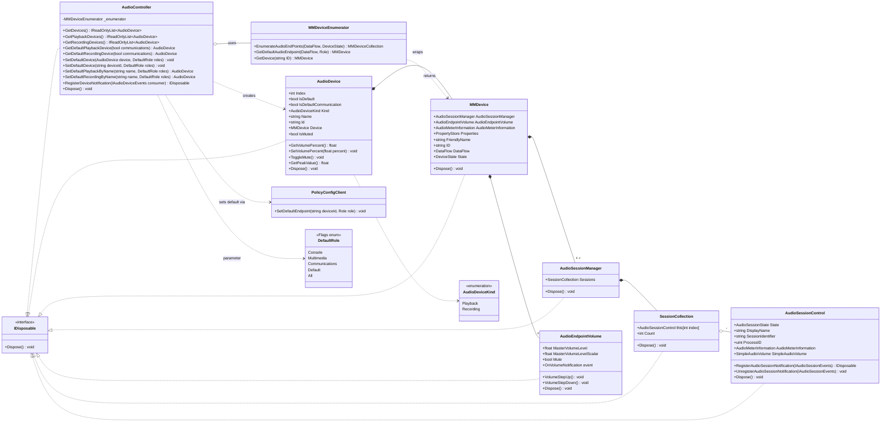

# Architecture (dev reference)

Internal design notes for AudioDeviceLib. Not linked from the public README — this
is for contributors.

`AudioController` is the entry point. It enumerates endpoints through an
`MMDeviceEnumerator`, hands back `AudioDevice` facades, and sets the default device
via the undocumented `PolicyConfigClient`. Each `AudioDevice` wraps an `MMDevice`,
which lazily activates the volume, session and metering sub-interfaces. Most of the
graph implements `IDisposable`.

