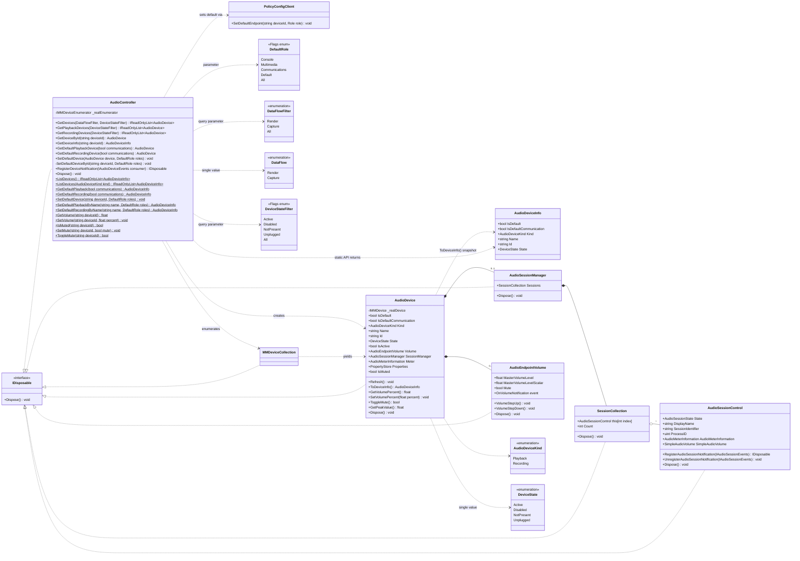

# Architecture (dev reference)

Internal design notes for AudioDeviceLib. Not linked from the public README — this
is for contributors.

`AudioController` is the entry point. It holds the `IMMDeviceEnumerator` directly
(created lazily), hands back `AudioDevice` instances, and sets the default device via
the undocumented `PolicyConfigClient`. `AudioDevice` is the single device type: it wraps
the `IMMDevice` itself, snapshots identity and state at construction, and lazily
activates the volume, session and metering sub-interfaces. Most of the graph implements
`IDisposable`.

Two invariants worth knowing before changing anything here:

- **Nothing is shared.** Core Audio returns a distinct COM object for every acquisition,
  on every path (`GetDevice`, `IMMDeviceCollection::Item`, `GetDefaultAudioEndpoint`), even
  for the same endpoint ID. So every `AudioDevice` owns its own RCW and disposing one can
  never strand another. This is what makes returning fresh instances safe, and it is why
  there is no device cache.
- **Deterministic COM release is limited to objects that never escape.** The enumerator,
  the `IMMDeviceCollection`, and the throwaway endpoint inside `TryGetDefaultId` are
  released with `Marshal.ReleaseComObject`. The device's own `IMMDevice` and the
  sub-interface RCWs are not: consumers can hold those, and each wrapper holds exactly one
  reference, so one stray double-release would throw `InvalidComObjectException`.

